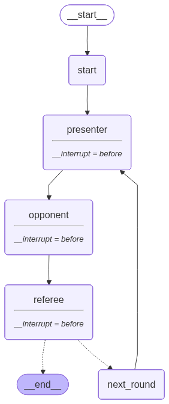

# 🎓 苏格拉底式学习引导系统

基于 LangGraph 的三智能体苏格拉底式学习系统。**提问者**通过苏格拉底式追问探询学习主题的边界与隐含前提、**精确化者**将用户的回应转化为精确表述、**引导者**将每轮对话揭示的新认知层次有机拼合到理解中（一句话逐步生长为一段话）。Reflex 提供响应式多Tab人机协作界面，LangSmith 提供全链路可观测性。

## 核心机制

```
每轮:
  提问者 探询学习主题的边界/前提 → 生成 question → [动态中断: 用户回应]
  精确化者 读用户回应 → 生成 draft → [动态中断: 用户确认]
  引导者 拼合新认知层次 → 有机追加到 current_thesis → 继续/结束
       │
       └── improvement_hint 反馈到下一轮提问者（闭环引导循环）
```

- **提问者（Opponent）**：通过苏格拉底式追问探询学习主题最薄弱的边界或隐含前提，三选一策略（逻辑探索 / 边界澄清 / 反例探询），单点突破，极简输出。引导者的 `improvement_hint` 为其提供上一轮的精准探询方向。哲学基础：认知通过探询边界而深化。
- **精确化者（Presenter）**：将用户非正式回应转化为边界清晰的精确表述，保留核心意图、消解歧义、明确适用范围。
- **引导者（Referee）**：将每轮对话中揭示的新边界、新限定有机拼合到理解中（保留核心认知，融入新层次）。正常轮次静默不输出，仅在学习会话终止时生成总结报告。支持两种输出策略：`with_structured_output`（OpenAI 原生）和 JSON-mode 手动解析（DeepSeek 兼容）。

`current_thesis` 是唯一跨轮次持久化的状态。每轮经提问、回应、精确化、确认后，引导者将新认知层次拼合进去，理解从一句话逐步生长为一段逻辑递进的完整论述，直到引导者判定充分深化为止。

## 代码质量

项目通过三层静态分析，全部零告警：

| 工具 | 命令 | 严格度 |
|------|------|--------|
| Ruff | `ruff check .` | 零告警 |
| Pyright | `pyright .` | strict 模式零错误 |
| Mypy | `mypy core/ agents/ workflow/` | 零错误 |

## 图结构

运行 `python -m workflow.graph` 或 `python run.py --export-graph` 可导出最新架构图。



## 快速开始

### 环境要求

- Python ≥ 3.11
- LLM API Key（DeepSeek / OpenAI / 其他兼容供应商任选其一）
- （可选）LangSmith API Key，用于链路追踪

### 配置

```bash
# 1. 克隆项目后，复制环境变量模板
cp .env.example .env

# 2. 编辑 .env，填入你的 API Key
#    默认配置为 DeepSeek，取消注释即可切换 OpenAI 或其他供应商
```

`.env` 示例：

```bash
# 方案 1: DeepSeek（默认）
LLM_MODEL=deepseek-chat
LLM_BASE_URL=https://api.deepseek.com/v1
LLM_API_KEY=sk-your-deepseek-api-key

# 方案 2: OpenAI（取消注释下面三行，注释掉上面三行）
# LLM_MODEL=gpt-4o
# LLM_API_KEY=sk-your-openai-api-key

# 方案 3: 其他 OpenAI 兼容供应商（Ollama / vLLM / 硅基流动 等）
# LLM_MODEL=your-model
# LLM_BASE_URL=https://your-api-endpoint/v1
# LLM_API_KEY=your-api-key

# LangSmith 链路追踪（可选；需要真实 LangSmith Key 时再取消注释）
# LANGCHAIN_TRACING_V2=true
# LANGCHAIN_API_KEY=lsv2_pt_your-key-here
# LANGCHAIN_PROJECT=ai-learning-loop
```

### 安装

```bash
python -m venv venv
source venv/Scripts/activate   # Windows Git Bash
# source venv/bin/activate     # macOS / Linux
pip install -e ".[dev]"
```

依赖文件角色：

- `pyproject.toml` 是开发环境的权威入口，包含运行时依赖和 `pytest` / `ruff` / `pyright` / `mypy` 等开发工具。
- `requirements.txt` 仅保留运行时最小版本约束，适合不需要开发工具的轻量部署。
- `requirements-lock.txt` 固定已验证版本，适合需要可复现构建的环境。

### 启动界面

```bash
# 推荐：通用启动器，自动处理路径和 .env 加载
python run.py                      # → http://localhost:3003

# 直接使用 Reflex CLI
reflex run
# Windows 需要设置 UTF-8 编码
PYTHONUTF8=1 reflex run
```

在侧边栏输入学习主题，点击「开始」。系统会依次展示提问者的苏格拉底式追问（你需要回应）和精确化者的草稿（你需要确认），点击「提交回应」/「确认」推进学习进程。

**多标签页支持**：点击「➕ 新辩论」可同时进行多个独立的学习会话，每个标签页拥有独立的论题、模型配置和演化历史，互不干扰。支持标签页重命名，关闭标签页自动清理 checkpoint 数据。点击「🗑️ 清空」一键关闭所有标签页。

**Per-tab 模型配置隔离**：每个标签页在启动时冻结当前的模型配置（模型名、端点、温度、最大轮次）。侧边栏修改仅对新启动的辩论生效，已运行的标签页不受影响。不同标签页可使用不同模型供应商进行对比实验。

**流式输出 + 打字动画**：LLM 响应以 token 级别实时流式展示，带闪烁光标 `▍` 模拟打字效果，需等待完整生成即可看到 AI 的思考过程。

**温度调节**：侧边栏滑块（0.0–1.5，默认 0.7）控制提问者和精确化者的创造性程度，适应不同学习风格。

**最大轮次安全阀**：侧边栏滑块（1–20，默认 10）设置辩论轮次上限，防止异常状态下限循环消耗 API 费用。

**错误边界**：流式执行异常时展示分类的中文错误提示（鉴权/超时/速率限制/网络/解析异常），可展开技术详情，支持一键重试（利用 checkpoint 从中断点恢复）。

**主题系统**：学术蓝品牌主题，支持明/暗色模式自动切换（跟随 OS 设置）。消息气泡带角色区分配色和时间戳，按钮有 hover 微交互动画。

**自动滚动 + Toast 通知**：新消息自动平滑滚动到底部，不会干扰手动阅读历史记录。辩论开始、恢复和完成时显示 Toast 通知，学习完成时播放气球庆祝动画。

### API Key 配置方式

**推荐：通过 `.env` 文件配置**（支持多供应商、LangSmith 追踪，配置持久化）：

```bash
cp .env.example .env
# 编辑 .env，填入你的 API Key
```

启动后侧边栏会自动检测 `.env` 配置并展示供应商信息。如需临时切换 Key，展开「手动覆盖 API Key」折叠面板即可。

**备选：通过侧边栏直接输入**（适合临时演示、未配置 `.env` 时）：

未检测到 `.env` 时，侧边栏会自动显示 API Key 输入框和高级模型设置。这些设置仅当前会话有效，刷新后需重新输入。注意：LangSmith 追踪必须通过 `.env` 配置（需在 LangChain 导入前设置环境变量）。

> **提示**：`python run.py` 从任意目录执行都能自动定位项目根目录并加载 `.env`。环境初始化统一由 `core/env.py` 的 `setup_environment()` 处理。

### 运行测试

```bash
python -m pytest tests/ -v    # Mock LLM，需真实 API
```

### 真实 API 集成测试

```bash
python scripts/integration_test_real.py           # 6 个集成测试全量运行（需 API Key）
python scripts/integration_test_real.py --quick   # 仅单 Agent 测试
python scripts/integration_test_real.py --workflow  # 仅 LangGraph 工作流测试
```

使用真实 API Key 测试完整系统（ Mock）。覆盖 Questioner / Refiner / Guide 单 Agent 有效性、LangGraph 完整单轮/多轮工作流、Checkpoint 持久性。**适配 DeepSeek**：引导者直接使用生产代码 `referee_deliberate_node(json_mode=True)`，需重复实现。

### 幽灵探针（环境诊断）

```bash
python scripts/ghost_probe.py           # 7 个探针全量运行，验证 LLM 环境健康
python scripts/ghost_probe.py --quick   # 仅快速探针（环境诊断 + API 连通性）
```

幽灵探针是独立的诊断脚本，用真实 API Key 探测 LLM 供应商环境：API 连通性、结构化输出合规、三个 Agent 提示词有效性、完整一轮苏格拉底式对话。不纳入 pytest。

## 支持的大模型供应商

通过 `core/model.py` 的 `get_chat_model()` 工厂函数，需修改任何代码即可切换 LLM：

| 供应商 | LLM_MODEL | LLM_BASE_URL |
|--------|-----------|--------------|
| DeepSeek | `deepseek-chat` | `https://api.deepseek.com/v1` |
| OpenAI | `gpt-4o` | （留空） |
| 硅基流动 | `Qwen/Qwen3-235B-A22B` | `https://api.siliconflow.cn/v1` |
| Ollama (本地) | `llama3` | `http://localhost:11434/v1` |
| 其他兼容供应商 | 任意 | 填入对应的 `/v1` 端点 |

> **DeepSeek 用户注意**：DeepSeek 不支持 `with_structured_output`（底层依赖 `response_format`）。系统已内置 JSON-mode 兼容策略，引导者节点通过 `json_mode=True` 参数自动切换到提示词引导 + 正则提取 + Pydantic 验证的方式，需手动适配。

## 可观测性

开启 LangSmith 后，每次学习会话会自动记录：

- 每个 Node（opponent / presenter / referee）的**输入输出和耗时**
- LLM 调用的**完整 Prompt 和原始 Response**
- **Token 用量**统计
- Graph 节点间的**调用拓扑**

访问 [smith.langchain.com](https://smith.langchain.com) 查看追踪面板。

## 项目结构

```
ai-learning-loop/
├── socratic_loop/           # 统一业务逻辑包
│   ├── core/                # 核心契约（所有模块的依赖根）
│   │   ├── env.py           # 统一环境初始化（sys.path + .env 加载）
│   │   ├── state.py         # AgentState（17 字段）+ make_initial_state + validate_state_shape
│   │   ├── schemas.py       # Pydantic 结构化模型（_StrictModel 基类，extra='forbid'）
│   │   ├── prompts.py       # System Prompt 与模板函数（提问/精确化/拼合/总结）
│   │   ├── model.py         # ModelConfig + load_model_config + has_configured_api_key + get_chat_model
│   │   ├── model_store.py   # 模型配置持久化（ProviderEntry / ModelProfile / CRUD）
│   │   ├── providers.py     # 8 个预置 LLM 提供商定义
│   │   ├── connection_test.py  # API 连通性检测
│   │   └── logging.py       # 结构化日志：trace_id_context + TraceLogger
│   ├── agents/              # 智能体节点（状态纯函数，compute + interact 拆分）
│   │   ├── _base.py         # 共享 LLM 工具（内容提取/消息构造/调用重试）
│   │   ├── opponent.py      # 提问者：苏格拉底式追问 + interrupt
│   │   ├── presenter.py     # 精确化者：用户回应 → draft + interrupt
│   │   └── referee.py       # 引导者：双策略认知拼合 + 判定 + 总结
│   └── workflow/            # 编排层
│       └── graph.py         # LangGraph 图组装（8 节点）、条件路由、export_graph()
├── web/                     # Reflex 展现层
│   ├── web.py               # 应用入口（路由注册）
│   ├── state.py             # 响应式状态管理 + LangGraph 后台任务
│   ├── chat.py              # 聊天页面组件
│   ├── model_settings.py    # 模型设置页面
│   ├── styles.py            # 全局样式系统
│   └── assets/fonts.css     # 字体与 Markdown 样式
├── tests/                   # 测试（211 个用例）
│   ├── helpers.py           # 共享工厂函数
│   ├── mock_nodes.py        # 共享 Mock Agent 节点
│   └── test_*.py            # 各模块测试
├── scripts/                 # 诊断与集成测试工具
│   ├── cleanup.py           # 缓存/构建产物清理
│   ├── ghost_probe.py       # 幽灵探针：7 个 LLM 环境探针
│   └── integration_test_real.py  # 真实 API 集成测试
├── docs/                    # 文档资源
│   └── graph_architecture.png   # 图结构（自动导出）
├── .github/workflows/       # CI 工作流
│   └── ci.yml               # 自动运行 pytest + ruff + pyright + mypy
├── pyproject.toml           # 项目元数据、依赖、ruff/mypy/pyright/pytest 配置
├── rxconfig.py              # Reflex 配置（端口、插件、transport）
├── run.py                   # 通用启动器
├── .env.example             # 环境变量模板
├── requirements.txt         # 运行时依赖
├── requirements-lock.txt    # 锁定依赖（可重现构建）
└── CLAUDE.md                # Claude Code 开发指南
```

## 架构原则

| 层级 | 职责 | 禁止 |
|------|------|------|
| `socratic_loop/core/` | 数据契约（State、Schema、Prompt、Model、Env） | 不得包含业务逻辑 |
| `socratic_loop/agents/` | 调用 LLM 生成内容（compute），通过 interrupt() 交互（interact） | 不得修改 State、不得自行扩展字段 |
| `socratic_loop/workflow/` | 状态流转、条件路由、节点编排 | 不得包含 LLM 调用、不得配置 interrupt_before |
| `web/` | 渲染数据、收集输入、检测中断并展示对应 UI | 不得修改 graph state、不得包含业务逻辑 |

- **UI 样式系统**： + `ui/style.css` 定义全局视觉规则（消息气泡、按钮动画、暗色模式等），`ui/style.py` 封装注入逻辑（CSS 加载 + 自动滚动 JS + 打字光标），`ui/app.py` 仅调用 `inject_global_css()`，保持渲染层纯净
- **统一环境初始化**：`core/env.py` 的 `setup_environment()` 消除 `run.py`、`ui/app.py` 和 `scripts/*.py` 中的分散初始化代码重复
- **模型工厂**：`get_chat_model()` 读取环境变量创建 LLM 实例，支持任意 OpenAI 兼容供应商。`load_model_config()` 将 env 解析为 `ModelConfig`，`has_configured_api_key()` 集中判断是否配置了真实 API Key（占位符不算）。模型默认开启 `streaming=True` 以支持 token 级流式输出
- **State 工厂与验证**：`make_initial_state(thesis, *, agent_temperature=0.7, model_name="", model_base_url="", max_rounds=10)` 是唯一权威的初始状态构造入口（UI、脚本、测试均复用）。`validate_state_shape(state)` 在 workflow 入口提供运行时校验，不完整状态在调度层早失败
- **Per-tab 模型配置隔离**：模型名和端点按标签页冻结（启动时从侧边栏捕获），通过 `AgentState._model_name` / `_model_base_url` 持久化传递。Agent compute 节点传递给 `get_chat_model()` 和 `invoke_llm()`（可选覆盖，优先级高于全局环境变量）。API Key 保持全局共享
- **LLM 依赖注入**：Agent 节点的 `model` 参数使用 `BaseChatModel` 类型（不再耦合 `ChatOpenAI`），方便测试和切换供应商
- **LLM 调用自动重试**：`invoke_with_retry()` 对所有瞬时错误（网络/超时/速率限制）自动重试 3 次，指数退避（1s/2s/4s）。`_is_retryable()` 通过异常名匹配判断可重试性。支持 `on_retry` 回调向 UI 报告重试进度
- **结构化日志与追踪**：`core/logging.py` 提供 `trace_id_context`（每请求生成唯一 trace_id）和 `TraceLogger`（LLM 调用耗时/成功/失败/重试计数）。`_run_stream()` 为每次 `graph.stream()` 创建 TraceLogger。日志为 JSON 行格式便于聚合
- **动态中断（`interrupt()`）**：人工介入通过节点内部的 `interrupt()` 调用实现，搭配 `Command(resume=...)` 恢复，不使用静态 `interrupt_before`
- **最大轮次安全阀**：`_route_after_referee` 在 `round >= max_rounds` 时强制终止，防止异常状态下限循环。`max_rounds` 由侧边栏滑块设置（1–20，默认 10），启动时捕获到 `AgentState.max_rounds`
- **流式错误边界**：`_run_stream()` 捕获非 `GraphInterrupt` 异常，按类型展示中文错误提示（鉴权/超时/速率限制/网络/JSON 解析），可展开技术详情，支持 checkpoint 重试恢复
- **Compute/Interact 拆分**：每个需要人工介入的 Agent 拆为 compute（LLM 调用，中断）和 interact（ LLM，含 `interrupt()`）两个节点，避免 resume 时 LLM 重复执行
- **多标签页架构**：共享一个 `MemorySaver` + 编译图，通过不同的 `thread_id` 值服务多个独立辩论会话。Widget key 使用 `tab_id` 命名空间隔离。关闭标签页时自动清理 checkpoint 数据防止内存泄漏
- **异步后台任务流式输出**：按钮回调仅设置 `pending_start`/`pending_resume` 标记，实际 `graph.stream()` 在渲染线程中执行，`st.empty()` 占位符渐进更新。`GraphInterrupt` 捕获中断点
- **状态分离**：`st.session_state` 仅存 UI 元数据（`sessions` 标签页注册表、共享 `checkpointer`/`graph`），学习会话状态完全存储在 LangGraph checkpointer 中
- **`current_thesis` 拼合式演化**：理解以"层层叠加"方式生长（原始核心认知 + 每轮发现的新认知层次 → 一句话生长为一段话）。提问、草稿、确认、改进方向均为 `_` 前缀轮次缓存（`_critique` / `_user_response` / `_draft_thesis` / `_confirmed_thesis` / `_improvement_hint`），每轮由 `next_round` 节点清空。`_model_name` / `_model_base_url` 为持久配置，不清除
- **可配置温度**：`agent_temperature`（0.0–1.5，默认 0.7）控制 Opponent 和 Presenter 的 LLM 创造性，Referee 固定 0.0（确定性判定）。侧边栏滑块控制，启动时捕获到 state
- **引导者双策略**：`referee_deliberate_node(json_mode=False/True)` — 默认使用 `with_structured_output`，DeepSeek 等不支持 `response_format` 的提供商可切换到 JSON-mode 手动解析
- **引导者静默路由**：正常轮次中引导者不输出对用户可见的消息，仅静默更新 `current_thesis` 并判定路由。`improvement_hint` 通过 `_improvement_hint` 缓存字段反馈给下一轮提问者
- **Schema 严格验证**：`_StrictModel` 基类 `ConfigDict(extra='forbid')` 拒绝未定义字段；移除 `RefereeJudgment.round`（始终被代码覆盖）

## 依赖

| 包 | 用途 |
|----|------|
| `langgraph` | 状态图编排、动态中断、checkpointer |
| `langchain-core` | 消息类型（SystemMessage / HumanMessage）、BaseChatModel |
| `langchain-openai` | 模型调用（兼容 OpenAI / DeepSeek / 所有兼容 API） |
| `pydantic` | 结构化数据模型与校验 |
| `streamlit` | Web UI |
| `python-dotenv` | 加载 `.env` 环境变量 |

### 开发依赖

| 工具 | 用途 |
|------|------|
| `ruff` | 代码风格与 Lint（零告警） |
| `pyright` | Strict 模式类型检查（零错误） |
| `mypy` | 补充类型检查（零错误） |
| `pytest` | 单元测试（Mock LLM，需真实 API） |

## License

MIT
